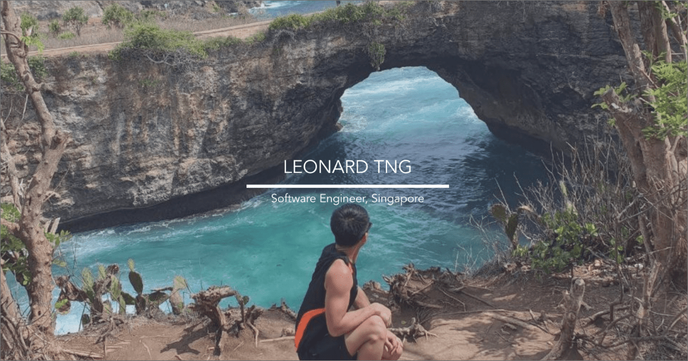

  

<h1 align="center">
  Leonard Tng - Personal Website
</h1>

  This is my first project, a website to showcase my skills as a developer.

  Visit the website at <a href="https://www.leonardtng.com/" target="_blank">leonardtng.com!</a>

## ❗  Disclaimer
While the website has already been deployed, the code in this repository is still in the process of optimisation, and I make regular updates to the code as often as I can. So if you would like to use any of the code but realise that it is not yet optimised, I apologise, do drop me a message and I'll work on it.

## ⭐  About this Website
This website was built using React, Material-UI and TypeScript.

## 😊  Contact Me
If you liked the website or just want to get in touch, email me at <a href="mailto:theleonardtng@gmail.com">theleonardtng@gmail.com</a> or drop me a message at the various social media platforms listed at the bottom of my website. Cheers.
